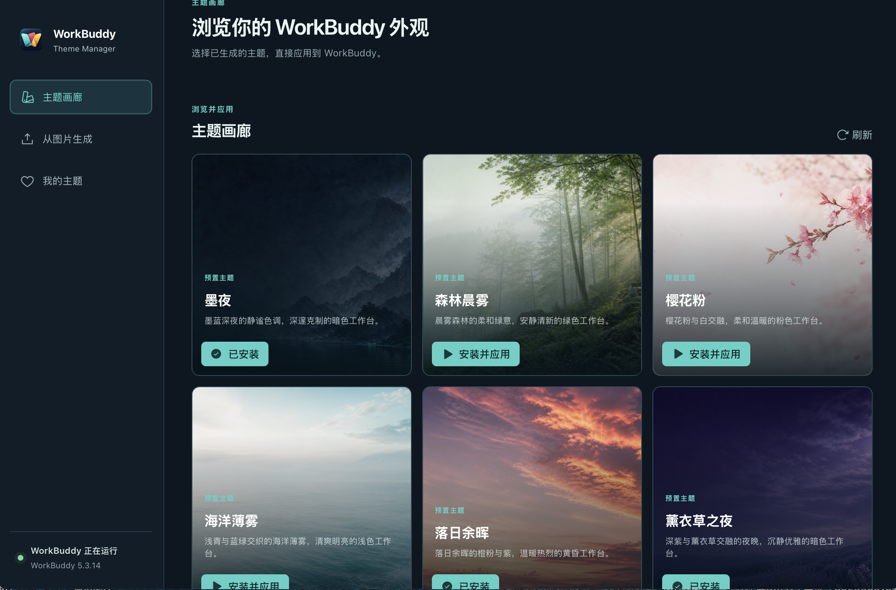
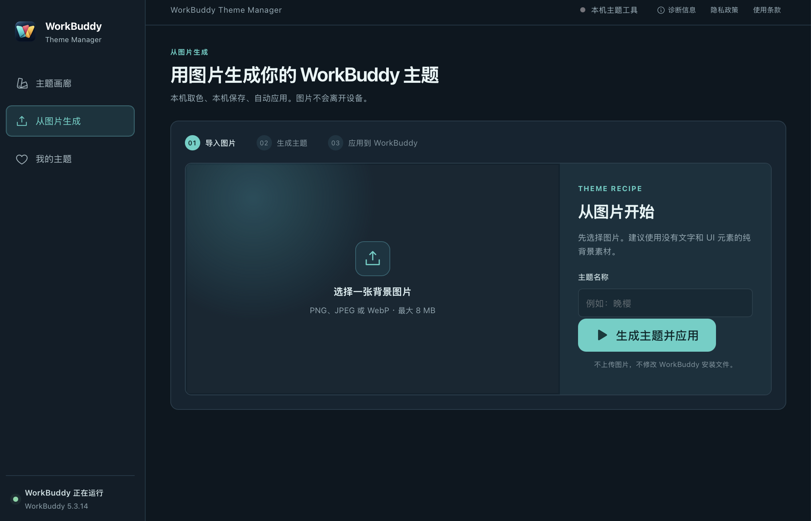
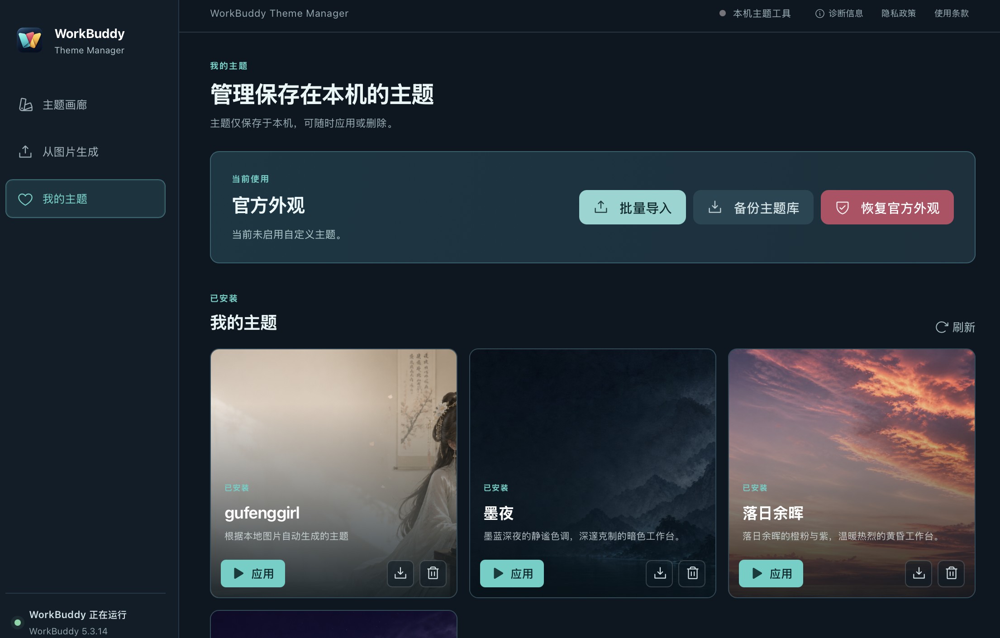
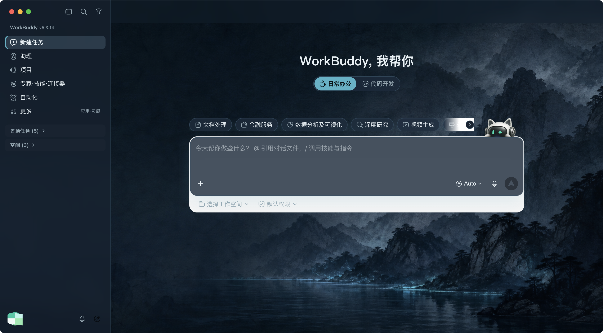
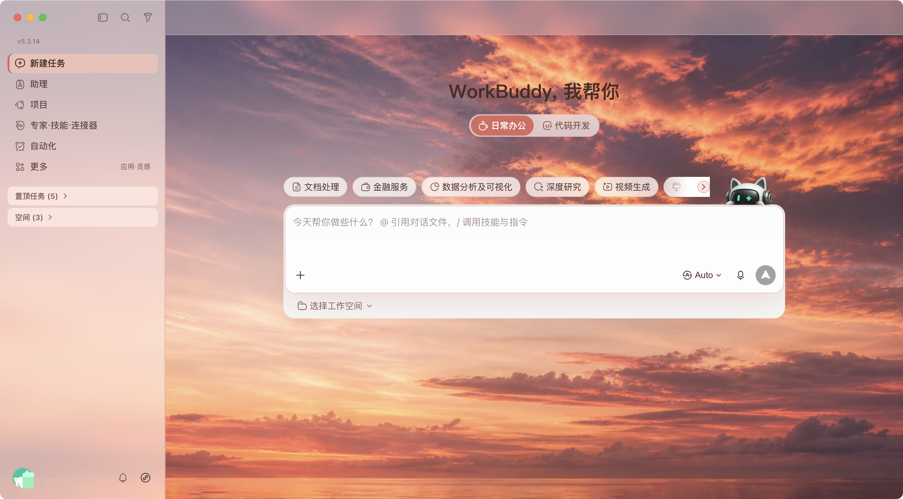
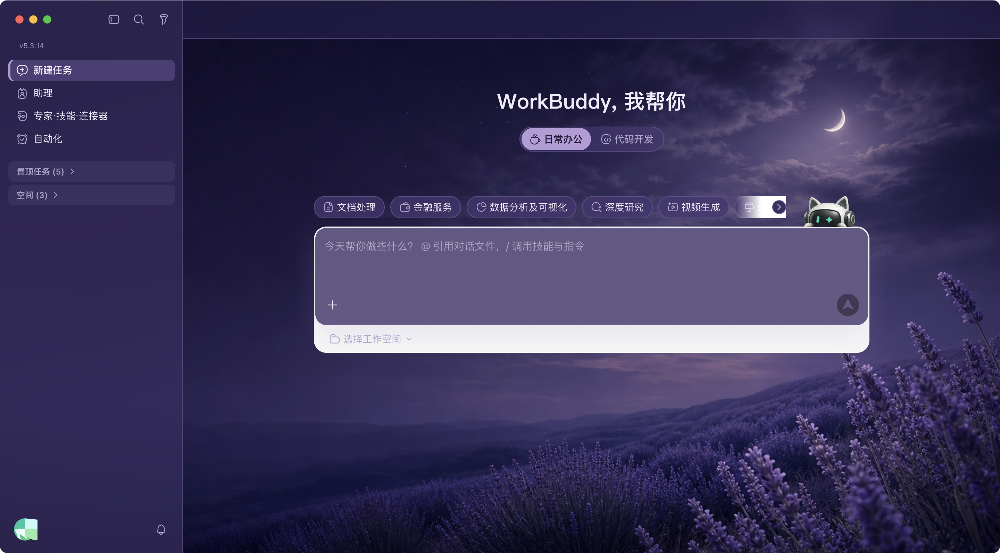

# WorkBuddy Theme Manager

<p align="center">
  
</p>

<p align="center"><strong>一张图片，生成、应用并守护你的 WorkBuddy 主题。</strong></p>
<p align="center">Turn one image into a WorkBuddy theme that stays.</p>

<p align="center">
  <a href="#界面预览">界面预览</a> ·
  <a href="#使用方法">使用方法</a> ·
  <a href="#从源码构建">源码构建</a> ·
  <a href="#安全模型">安全模型</a>
</p>

WorkBuddy Theme Manager 是面向非技术用户的本地桌面工具。选择一张背景图，应用会在本机提取配色、生成主题并应用；WorkBuddy 页面刷新后，Manager 会自动恢复主题。WorkBuddy 以普通模式重新启动时，Manager 会等待你确认，不会在后台擅自重启它。

它不修改 WorkBuddy 安装包，而是通过本机 CDP 会话注入纯视觉样式，随时可以一键恢复官方外观。主题生成、校验、应用、守护与恢复全部内置在同一个客户端。项目以源代码形式发布，使用者需在本机完成构建和安装。

法律与隐私信息见 [LICENSE](LICENSE)、[PRIVACY.md](PRIVACY.md) 和 [TERMS.md](TERMS.md)。

## 界面预览

### 主题画廊



### 图片生成



### 我的主题




## 精选主题展示

### 墨夜
墨蓝深夜的静谧色调，深邃克制的暗色工作台



### 落日余晖
落日余晖的橙粉与紫，温暖热烈的黄昏工作台



### 薰衣草之夜
深紫与薰衣草交融的夜晚，沉静优雅的暗色工作台



## 你会得到什么

- 从图片生成主题：选择本地背景图，本机提取配色并生成高对比度主题。
- 主题画廊：浏览森林晨雾、薰衣草之夜、墨夜、海洋薄雾、樱花粉、落日余晖 6 个预置主题，一键安装并应用。
- 导入与导出 `.wbskin` 主题包：在“我的主题”中迁移经过校验的主题。
- 我的主题：预览、应用、导出或删除保存在本机的主题。
- 常驻守护：WorkBuddy 页面刷新后自动重新应用；需要重启 WorkBuddy 时先征得确认。
- 版本与位置检测：显示 WorkBuddy 版本和安装路径，并支持选择自定义安装位置。
- 开机启动：登录系统后在后台启动 Manager，不主动弹出主窗口。
- 本机诊断：查看并复制版本、运行状态和日志位置，便于定位问题。
- 一键恢复：恢复官方外观并停止主题守护。

## 使用方法

### 1. 首次打开与检测 WorkBuddy

1. 启动 WorkBuddy Theme Manager，侧栏底部会显示 WorkBuddy 的安装、运行和版本状态。
2. 如果提示“未检测到 WorkBuddy”，点击「选择安装位置」。macOS 选择 `WorkBuddy.app`，Windows 选择 WorkBuddy 的 `.exe`。
3. 如果版本显示“暂不兼容”，先确认 WorkBuddy 是否属于当前支持的 `5.2.x` 或 `5.3.x`。

### 2. 使用预置主题

1. 打开「主题画廊」，选择一个预置主题。
2. 点击「安装并应用」。如果 WorkBuddy 正在运行，应用会提示你先保存工作并确认重启。
3. 应用成功后，主题会出现在「我的主题」中；画廊里的按钮会变为「已安装」。
4. WorkBuddy 页面重载后，Manager 会在后台重新应用当前主题。

### 3. 从图片生成主题

1. 打开「从图片生成」，选择 PNG、JPEG 或 WebP 图片。
2. 填写主题名称，点击「生成主题并应用」。
3. Manager 会在本机提取配色、生成高对比度主题并保存到主题库，然后请求确认重启 WorkBuddy。
4. 如果取消应用，已经生成的主题仍会保存在「我的主题」中，可以稍后应用。

建议使用不含文字、按钮或模拟界面的纯背景图片。图片不会上传；单张图片最大 8 MB、最长边 8192 px、总像素不超过 4000 万。

### 4. 导入、导出与备份主题

- 在「我的主题」点击「批量导入」，可一次选择多个 `.wbskin` 主题包；单个损坏包不会阻止其他有效主题继续导入。
- 每张已安装主题卡片提供导出和删除按钮；导出的 `.wbskin` 可以迁移到其他设备。
- 点击「备份主题库」，选择目标目录后，应用会创建独立的带时间戳备份目录。
- 无法读取的主题会单独显示原因，可以删除后重新导入原主题包。

### 5. 恢复、退出与辅助设置

- 点击「恢复官方外观」，确认重启 WorkBuddy 后会清除当前主题状态并恢复普通启动方式。
- 关闭 Manager 主窗口只会隐藏到菜单栏或系统托盘，主题守护仍会运行。
- 从菜单栏或托盘选择「完全退出」，Manager 会先恢复必要的普通启动状态，再结束守护。
- 「我的主题」底部可以启用开机启动、更改 WorkBuddy 安装位置或恢复自动检测。
- 顶部「诊断信息」可以查看 Manager 版本、WorkBuddy 状态、日志位置和最近错误。

## 兼容范围

- macOS（Intel / Apple Silicon）
- Windows 10 / 11 x64
- WorkBuddy `5.2.x`、`5.3.x`

macOS 会检查 `/Applications/WorkBuddy.app` 和 `~/Applications/WorkBuddy.app`，并核对应用 bundle ID；Windows 会优先检查常见安装目录，再检查正在运行的 WorkBuddy 和卸载注册表。自动检测失败时，可在“我的主题”底部选择 WorkBuddy 应用；保存的自定义位置优先于 `WORKBUDDY_PATH` 环境变量和自动检测结果。

在 Apple Silicon Mac 上，如果安装的 WorkBuddy 仍是 `x86_64` 版本，系统需要安装 Rosetta 2；Manager 的 Universal 构建不能替代 WorkBuddy 自身的架构支持。

主题不修改 WorkBuddy 安装包。Manager 每次随机分配仅监听 `127.0.0.1` 的端口，并校验端口对应的 WorkBuddy 进程；WorkBuddy 大版本升级后需要重新验证组件选择器和兼容范围。

## 安全模型

- 主题只保存经过校验的 JSON 配置和本地图片。
- 不接受脚本、CSS、可执行文件或远程资源。
- 取色与图片处理全部在本机完成，不上传。
- 主题状态使用带版本的原子写入、备份与故障恢复；无法识别的新版本配置会保留原文件，应用失败后自动恢复普通启动模式。
- 导出先写入临时文件并完成同步，再替换用户选择的目标文件；不会写入 Manager 主题库。
- 主题库备份先在临时目录生成全部包，全部成功后再一次性发布为独立备份目录。

## 从源码构建

当前版本只发布源码，不内置自动更新，也不提供官方预编译安装包。使用者需要在目标系统上自行构建。

### 环境要求

- Node.js 22
- Rust stable 与 `rustup`
- npm（仓库提交 `package-lock.json`）
- 已安装并可正常启动的 WorkBuddy `5.2.x` 或 `5.3.x`

获取源码并安装依赖：

```bash
git clone https://github.com/ErickPang/workbuddy-skin-manager.git
cd workbuddy-skin-manager
npm ci
```

### macOS Universal DMG

在 macOS 执行：

```bash
rustup target add aarch64-apple-darwin x86_64-apple-darwin
npm run tauri build -- --target universal-apple-darwin --bundles dmg
```

该构建同时支持 Apple Silicon 与 Intel Mac。若 Apple Silicon Mac 上安装的是 `x86_64` WorkBuddy，系统仍需安装 Rosetta 2。

### Windows NSIS

在 Windows 10 或 Windows 11 x64 执行：

```powershell
npm run tauri build -- --bundles nsis
```

构建产物位于 `src-tauri/target/` 对应 target 的 `release/bundle/` 目录。CI 只检查 macOS 与 Windows 能否完成无签名构建，不发布安装制品。

## 版本升级

通过 Git clone 获取项目的用户：

```bash
git pull --ff-only
npm ci
npm run check
```

验证通过后，按对应平台命令重新打包并安装。通过 GitHub Source code 压缩包获取项目的用户，需要下载新版本源码后重新构建。

## 本地开发与验证

启动 Tauri 开发环境：

```bash
npm ci
npm run tauri dev
```

提交前验证：

```bash
npm run check
(cd src-tauri && cargo fmt --check)
(cd src-tauri && cargo test)
(cd src-tauri && cargo clippy --all-targets -- -D warnings)
```

修改前端或 theme engine 后至少运行 `npm run check`；修改 Rust 后端后至少运行 `cargo fmt --check` 与 `cargo test`，提交前按影响范围运行 Clippy。不要把 `npm run tauri build` 当作日常验证，它会实际制作平台安装包。

## 常用命令

| 命令 | 作用 |
| --- | --- |
| `npm run tauri dev` | 启动桌面应用开发环境 |
| `npm run build` | TypeScript 检查并构建 Vite 前端 |
| `npm test` | 运行前端与 theme engine 单元测试 |
| `npm run check` | 前端构建 + 前端与 theme engine 单元测试 |
| `cargo fmt --check` | Rust 格式检查（在 `src-tauri` 内执行） |
| `cargo test` | Rust 单元测试（在 `src-tauri` 内执行） |
| `cargo clippy --all-targets -- -D warnings` | Rust 静态检查（在 `src-tauri` 内执行） |

## 安全边界

- CDP 只使用 `127.0.0.1` 随机端口，连接前确认端口属于检测到的 WorkBuddy 进程。
- 不修改 WorkBuddy 安装包、代码签名或运行文件。
- 本地主题图片只从受控的应用数据目录加载。
- 不提交密钥、Token、用户主题数据、构建产物或日志。

## 常见问题

### 为什么应用主题需要重启 WorkBuddy？

Manager 需要以仅监听本机回环地址的 CDP 会话启动 WorkBuddy，才能安全应用和持续守护运行时样式。每次需要重启时都会先让用户确认，不会强制结束进程。

### 为什么关闭 Manager 窗口后程序还在运行？

关闭窗口只会隐藏到菜单栏或系统托盘，这是为了在 WorkBuddy 页面重载后继续恢复主题。需要彻底退出时，请使用托盘菜单中的「完全退出」。

### 检测不到 WorkBuddy 怎么办？

点击界面的「选择安装位置」或「更改位置」，手动选择可信的 `WorkBuddy.app` 或 WorkBuddy `.exe`。Manager 会继续校验应用标识、可执行文件和版本，不会接受任意 Electron 应用。

### WorkBuddy 升级后主题显示异常怎么办？

先恢复官方外观，再确认仓库是否已经发布兼容修复。WorkBuddy 的 DOM 结构可能随版本变化，当前只声明支持经过验证的 `5.2.x` 与 `5.3.x`。

### 为什么仓库没有可直接下载的安装包？

当前采用源码发布模式，尚未建设 Apple notarization、Windows Authenticode 签名和自动更新流程。用户需要按照「从源码构建」在自己的系统上打包。

## 贡献

提交 Issue 时请附上操作系统、Manager 版本、WorkBuddy 版本、复现步骤和诊断信息中的错误摘要。涉及兼容性或主题显示的 Pull Request，应同时补充相应自动测试；不要提交用户主题数据、日志、密钥或构建产物。

## 许可与声明

本项目使用 [MIT License](LICENSE)。WorkBuddy Theme Manager 是独立的开源项目，与 WorkBuddy 的开发者或发行方无隶属、授权或背书关系；WorkBuddy 名称仅用于说明兼容对象。

使用本项目时还应遵守 [隐私政策](PRIVACY.md) 与 [使用条款](TERMS.md)。

## 项目结构

| 路径 | 职责 |
| --- | --- |
| `assets/screenshots/` | GitHub README 界面截图，不参与桌面应用打包 |
| `src/` | React 19 + TypeScript 前端 |
| `src-tauri/src/` | Rust 后端：命令、菜单栏/托盘、守护、主题库与 WorkBuddy 平台实现 |
| `src-tauri/resources/theme-engine/` | 随应用打包的 CommonJS CDP 引擎 |
| `src-tauri/resources/preset-themes/` | 随应用打包的预置主题目录 |
